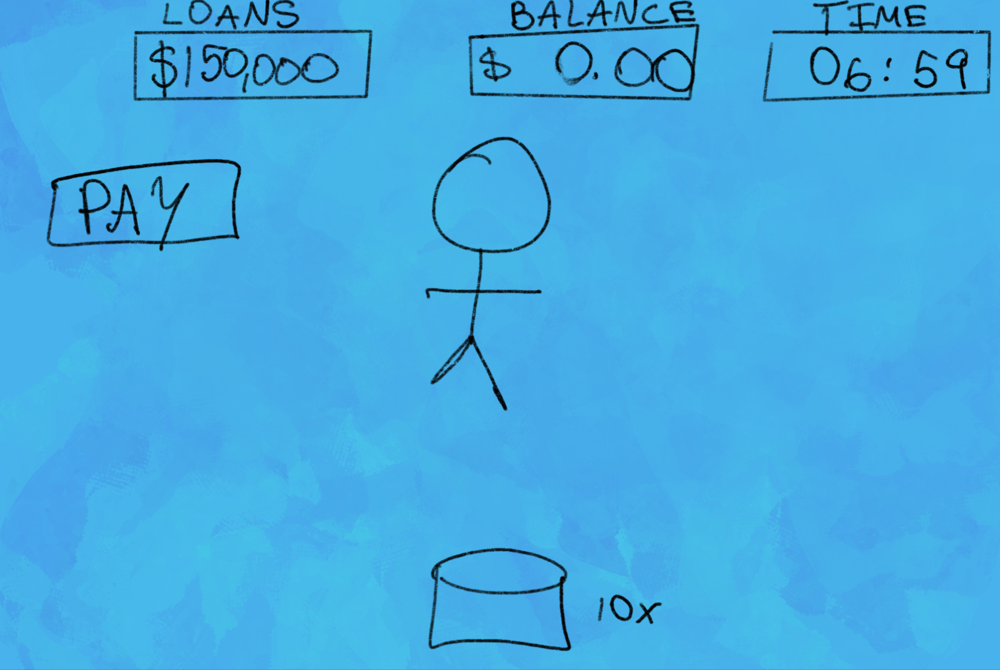

:warning: Everything between << >> needs to be replaced (remove << >> after replacing)

# << Project Title >>
## CS110 Final Project  << Semester, Year >>

## Team Members

Steven Doljansky

***

## Project Description

Pyramid scheme simulator. Run and manage your own pyramid scheme. Will you pay off your devastating financial obligations in time?

***    

## GUI Design

Top window showing money owed to IRS, Banks, and Mafia on the right side and slider allowing you to take out loans with varying interest rate tied to your credit score (tied to previous loans owed) as well as a display showing interest owed which is deduced by your interest rate and total loans.

Timer in the middle top of the screen of 7 minutes countdown when press play

Starts with one person (you) in the middle of the screen and you purchase button. Click button 100 times to hire first person.
Each person on the most bottom layer makes $15. Second layer of people hire a new person every 30-50 seconds. Stop hiring after 4 people on second layer (people hired by second layer before also hire a new person in 20-30 seconds). $15 per 25 seconds on very bottom layer. Each layer adds 1 to power of money made on the layer below them.

def generate_random_string(length):
    letters = string.ascii_letters
    result_str = "".join(random.choice(letters))

name = 'A'
people = {}
for _ in range(1000):
    people[name] = random.randint(10)
    name = ord(name)
json.dump()

### Initial Design

### Final Design

## Program Design

### Features

1. Start Screen Before Game/Timer Starts
2. Countdown Timer
3. Button (clicker to hire next employee)
4. Visual Representation of Totally Not a Pyramid Scheme
5. Names of Employees

### Classes

- << You should have a list of each of your classes with a description >>

## ATP

| Step                 |Procedure             |Expected Results                   |
|----------------------|:--------------------:|-----------------------------------------------------------------:|
|  1                   | Run itsallhere.py    |game display opens. tutorial box is visible. Esc closes program   |
|  2                   | Click play button    |GUI opens. Timer starts from 7 min. 150,000 in Loans $0 balance. Option to pay button      |
|  3                   | Click button 10x     |Number of people goes to 1. $1/sec added to balance.              |
|  4                   |Continue pressing btn |Every 10 times one person added. 2 people rate $2/sec per person $4/sec total|
|  5                   | Continue pressing btn|Balance grows exponentially   |
|  6                   | If esc at any point  |Tutorial display opens back up. Progress not saved. Another esc closes program|
|  7                   | Press pay loan       |Deducts balance and deducts loan amount. If loan paid then win screen   |
|  8                   | Timer runs out       |Lose screen                                                |