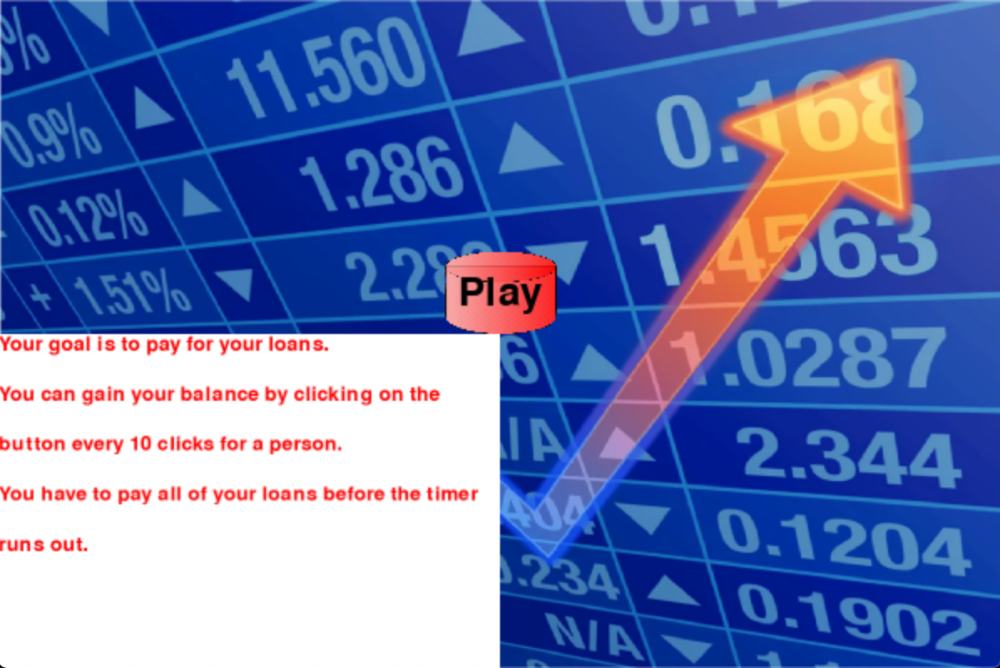

#  Pyramid Scheme Simulator 
## CS110 Final Project   Spring, 2024 

## Team Members

Steven Doljansky

***

## Project Description

Pyramid scheme simulator. Run and manage your own pyramid scheme. Will you pay off your devastating financial obligations in time? In this project the player has to pay off $150,000 in debt in 7 minutes by recruiting people into their pyramid scheme. To recruit people, click the button 10 times. 1 person generates $1/sec. Then continue clicking the button for exponential growth. 2 people in your scheme makes it so that each person makes $2/sec bringing the total rate for 2 people to be $4/sec. To pay off the loans and transfer balance amount click the Pay button. Good luck!

***    

## GUI Design

Top window showing monetary obligations (unpaid loan amount), balance, and time left.
Person on the left side of the screen with x(int) amount of people showed. This is the amount of people that are working for you.

Timer in the right side top of the screen of 7 minutes countdown that starts as soon as player hits play.
Click button 10x to hire first person and make $1 per person per second.
Once you have money in your balance you can hit the pay button to deduce that amount from your loan.
Continue hitting button 10x for hiring more people for exponential growth in rate of money being added to your balance. 
2 people make $2 per person per second.
3 people make $3 per person per second and so on.

### Initial Design

### Final Design

## Program Design

### Features

1. Start Screen Before Game/Timer Starts
2. Countdown Timer
3. Button (clicker to hire next employee) (10 clicks for +1 employee)
4. Visual Representation of How many people are working for you
5. Stonks background 
6. Balance amount 
7. Pay button to transfer money from balance to financial obligations

### Classes

ImageButton: Constructs a clickable button. This constructs how the buttons would look like and for the detection of a click of the button. It also explains to the computer that these buttons will have a set position.

Models: Constructs the initial loan_balance (your initial balance which would be 0) as well as the initial debt obligations in loan_amount (150,000) and the initial amount of people in the pyramid scheme (0)

Controller: Contains multiple functions such as how the game will be running, initializes the timer, handles the blitting of the images like the background and buttons. It also handles the win and lose screen and the rate at which you will make money via how many times the button was clicked and how many people are working in your scheme. 

## ATP

| Step                 |Procedure             |Expected Results                   |
|----------------------|:--------------------:|-----------------------------------------------------------------:|
|  1                   | Run sample_controller.py    |game display opens. tutorial box is visible. Esc closes program   |
|  2                   | Click play button    |GUI opens. Timer starts from 7 min. 150,000 in Loans $0 balance. Option to pay button      |
|  3                   | Click button 10x     |Number of people goes to 1. $1/sec added to balance.              |
|  4                   |Continue pressing btn |Every 10 times one person added. 2 people rate $2/sec per person $4/sec total|
|  5                   | Continue pressing btn|Balance grows exponentially   |
|  6                   | If esc at any point  |Tutorial display opens back up. Progress not saved. Another esc closes program|
|  7                   | Press pay loan       |Deducts balance and deducts loan amount. If loan paid then win screen   |
|  8                   | Timer runs out (unpaid)      |Lose screen                                                |
|  9                   | Loans paid for      |Win screen                                                |